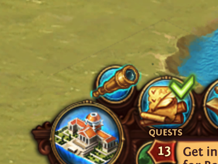
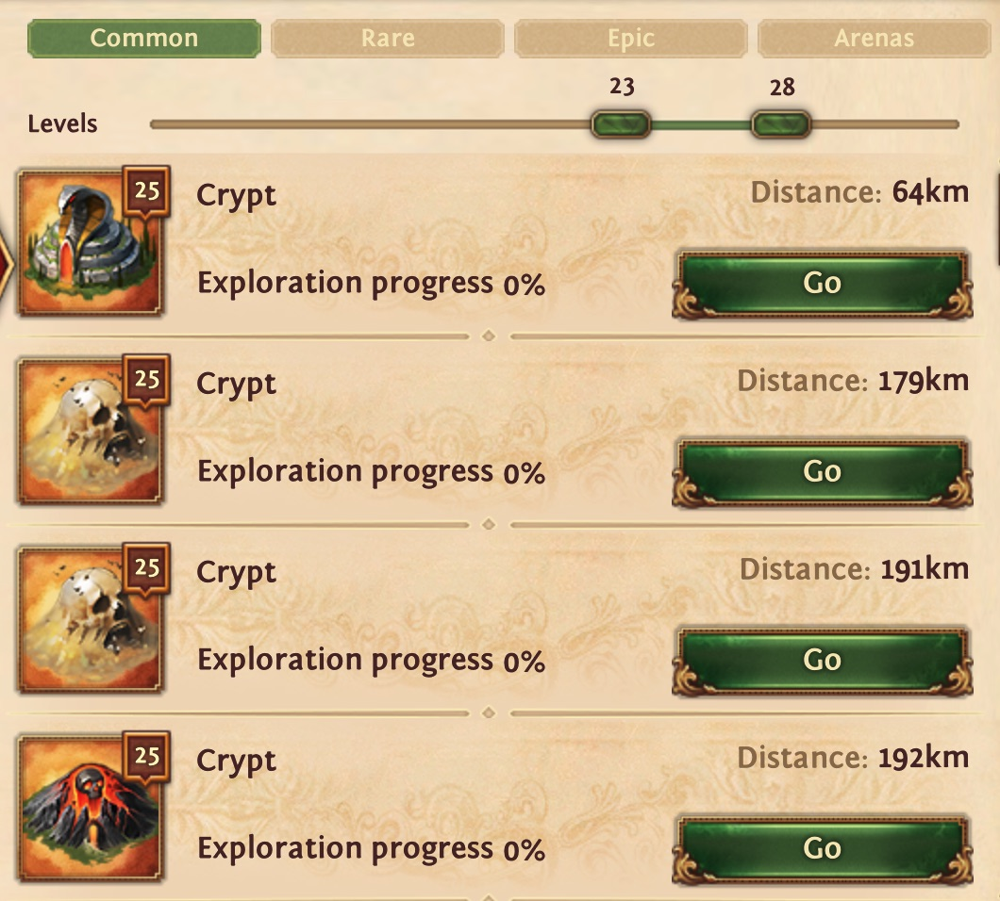
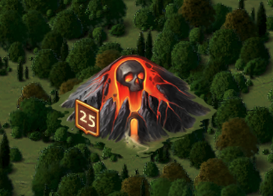
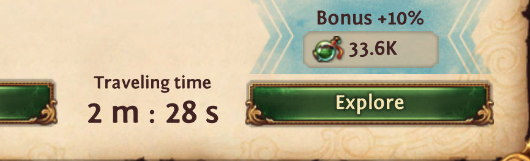
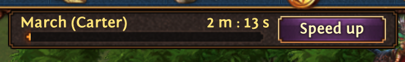
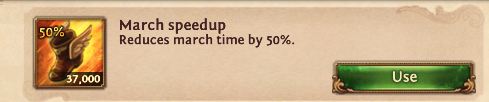

# TotalBattleApp
Allows doing automatic mouse operations. Currently, there are two functions. Autoclicking (eg: for opening tons of daily jobs). Auto crypter for **common** and **epic** crypts (rare needs additional click for opening, will implement in future).

# Donation

If the app helped you, feel free to donate.

### $$$

[](https://www.paypal.com/donate/?hosted_button_id=Z9RYF3N2UTQWQ)

### €€€

[](https://www.paypal.com/donate/?hosted_button_id=GQTGJMF2CR592)

## Technology stack
**Kotlin, Swing, Gradle** 

## Prerequisites
Be able to run java program. To do this you must install JDK (java development kit). Yes for just running java program, JRE (java runtime environment) is enough (advanced people can try it). But because I am programmer I am using JDK and I didn't try that just with JRE.

So install JDK17. 

### MacOS

[Here](https://www.oracle.com/java/technologies/downloads/#jdk17-mac)

I would go with DMG installer. Use appropriate version based on your processor architecture. x64 vs arm64 (M1, M2 processors)

### Windows
[Here](https://www.oracle.com/java/technologies/downloads/#jdk17-windows)

When installation is successful you would be able to run command line with command below:
> java - version

And it prints correctly your new installed java version 17. Here is just sample about mine java 19:
```
openjdk version "19.0.2" 2023-01-17
OpenJDK Runtime Environment Zulu19.32+13-CA (build 19.0.2+7)
OpenJDK 64-Bit Server VM Zulu19.32+13-CA (build 19.0.2+7, mixed mode, sharing)
```

## Auto Clicker Screenshot


## Crypt Maker Screenshot


## How to use the application?

Note to say that screenshots are from MacOS. On windows it looks a little bit different.

Application store the points where it clicks on file system. It expects te be under **HOME_DIRECTORY/tmp/tbapp**. So be sure you have this directory created. Applications always stores all the points before exit to the **coords.txt** file. 

At the end it should look like:

> /Users/SpeedyGonzales/tmp/tbapp/coords.txt

> /Users/SpeedyGonzales/tmp/tbapp/TotalBattleApp-all.jar

or prefixed with c:/ on windows

### Download

Download application [from](https://github.com/wondris009/auto-clicker/tree/main/downloads)

### Run application
Run command line / bash / terminal and run there command:
> java -jar TotalBattleApp-all.jar

### HotKeys

**CTRL + F1** | exit application

**CTRL + ALT + left mouse click** | add new click point for crypting 

### Define points for crypting

You need to select directly six points which crypter needs to work correctly. Points are selected when you hit CTRL + ALT + left mouse. After you select point it should appear in text area in the bottom part of Crypt maker tab. Try to click in the middle of the requested point / area. If you make mistake, zou can delete last point with button **Remove last value** button or you can delete all points with **Clear all button**. **Simulate** button just go through the points so you can see if it moves to right positions (not needed to use it).

Points:
1. Watchtower icon location



2. Open watchtower and select any "Go button" with selected crypt



3. Crypt position on the map.



4. Explore button 



5. Speedup button



6. Use speedup button


   

### Setup app for auto crypting

* Setup points (step above).
* Set Carter as first captain. 
* Set correct gear. 
* Turn on archeologist (optional).
* In watchtower select crypt you want to make. When crypting starts it will open watchtower and there must be "Crypts and Arenas" tab selected.
* Go to map and select highest zoom 125%
* Select number of rounds you want to do (after 100 per day, crypts are not appearing in the middle of the screen (3rd bullet in the point list) and app starts failing)
* Click **Make Common or Epic Crypts !!!** button - it will give you 5 seconds before it really starts clicking
* **MOST IMPORTANT make focus on browser, so after Make Common and Epic Crypts button click there**

In any trouble hit CTRL + F1 and it should close the application. I have seen bug when i hit the exit shortcut and it didn't exit. I had to restart computer. Happened one time. Shortcut is important for autoclicking and problematic scenarios. When you set 10000 autclicks and there is some initial problem (eg.: no focus on browser, wrong captain set, wrong gear) use it.
