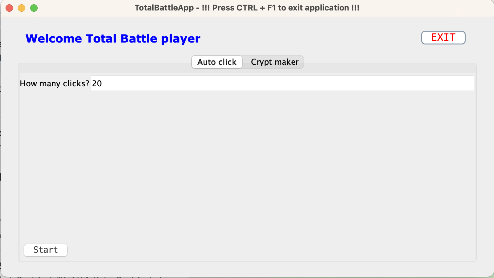
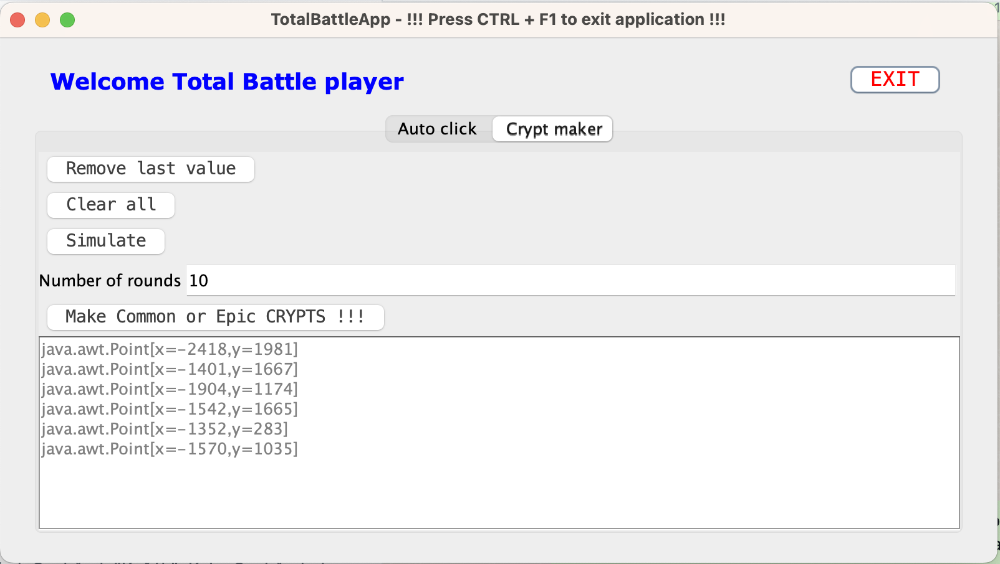

# TotalBattleApp
Allows doing automatic mouse operations. Currently, there are two functions. Autoclicking (eg: for opening tons of daily jobs). Auto crypter.

## Auto Clicker Screenshot


## Crypt Maker Screenshot


## Technology stack
**Kotlin, Swing, Gradle** 

## Prerequisites
Be able to run java program. To do this you must install JDK (java development kit). Yes for just running java program, JRE (java runtime environment) is enough (advanced people can try it). But because I am programmer I am using JDK and I didn't try that just with JRE.

So install JDK17. 

### MacOS

[Here](https://www.oracle.com/java/technologies/downloads/#jdk17-mac)

I would go with DMG installer. Use appropriate version based on your processor architecture. x64 vs arm64 (M1, M2 processors)

### Windows
[Here](https://www.oracle.com/java/technologies/downloads/#jdk17-windows)

When installation is successful you would be able to run command line with command below:
> java - version

And it prints correctly your new installed java version 17. Here is just sample about mine java 19:
```
openjdk version "19.0.2" 2023-01-17
OpenJDK Runtime Environment Zulu19.32+13-CA (build 19.0.2+7)
OpenJDK 64-Bit Server VM Zulu19.32+13-CA (build 19.0.2+7, mixed mode, sharing)
```


## How to use the application?
### Download
First download the app [click here](https://github.com/wondris009/auto-clicker/actions). Click the on the most upper row in the table (in the picture there is "rename ZIP" but its just commit message of last code change, so in reality there will be something different).

Download the ZIP file

Unpack it somewhere on your disk `eg. HOME_DIR/tmp/tbapp/` - **so there must be TotalBattleApp-all.jar file**

### Run application
Go to the directory where you unpacked the ZIP file. Run command line / bash / terminal and run there command:
> java -jar TotalBattleApp-all.jar

### Setup app for auto crypting